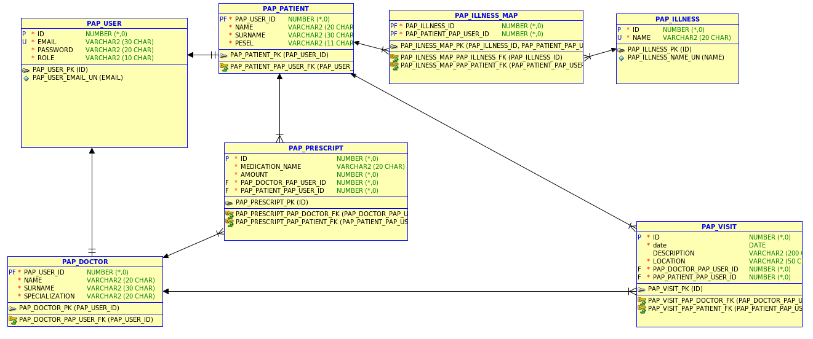

# PAP21Z-Z14

## Temat

Aplikacja webowa - przychodnia lekarska

## Opis

Aplikacja webowa obsługująca przychodnię lekarską, która ma na celu zautomatyzowanie procesu umawiania wizyt oraz wystawiania recept. Dostępny również panel dla wszystkich pacjentów pozwalający na przeglądanie wypisanych recept oraz nadchodzących wizyt.

### Jak to działa?
Użytkownik rejestruje się do systemu podając swoje dane osobowe oraz e-mail i hasło. Stworzony jest osoby panel dla lekarzy i pacjentów. Każdy z nich posiada inne funkcjonalności.

## Funkcjonalnosci

### Pacjent

-   wyświetlanie i edycja danych osobistych
-   umawianie wizyty
-   dostęp do historii medycznej (diagnozy oraz przebyte choroby)
-   powiadomienia przypominające o nadchodzących wizytach
-   dostęp do wystawionych e-recept
-   edycja terminu wizyt

### Lekarz

-   wgląd do historii medycznej pacjentów
-   edycja historii medycznej pacjentów
-   harmonogram wizyt
-   ustalanie harmonogramów wizyt
-   wystawianie recept

## Model bazy danych

## Stack technologiczny

### Front-end

-   JavaScript
-   React.js
-   CSS
-   Material-UI

### Back-end

-   Java
-   Spring Boot 2
-   Hibernate

### Baza danych

-   Oracle Database

### Narzędzia

-   SQL Developer
-   Docker (?)
